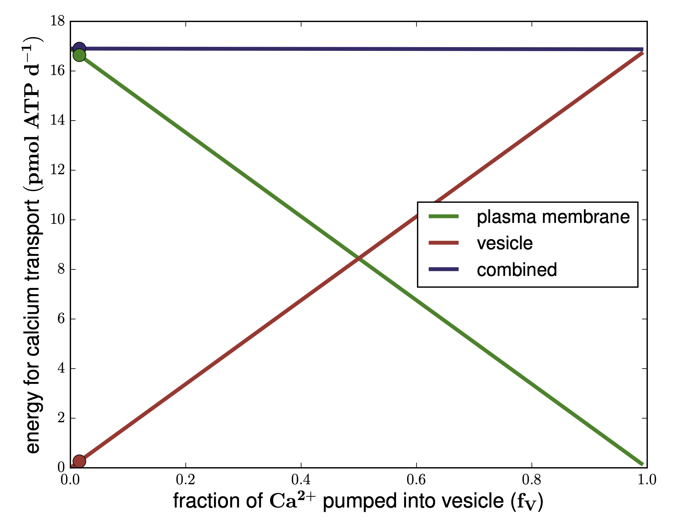

# calcisphere
Calculate the energy requirements for calcium transport into vesicles vs over the 
plasma membrane in calcifying nannoplankton.

# General description
This code calculates the energy required to maintain calcium homeostasis in single 
celled organisms like calcifying nannoplankton. In order to maintain calcium 
homeostasis, a cell must export as many calcium ions as the number of calcium ions entering the cytoplasm. 
Calcium enters the cell via channels that can be either opened or closed. The 
channels are relatively large pores that allow for a fast entry of calcium into 
the cell. The spike of increased intracellular calcium due to the opening of channels 
is used for intracellular signalling. However, in order to meet the requirement of 
low intracellular calcium concentrations for optimal cell functioning, 
cells use a combination of Na-Ca-exchangers (with a relatively high maximal 
transport rate but a low affinity for intracellular calcium) and Ca-ATPases to keep intracellular 
calcium to low (micromolar) concentrations. Since active ion transport requires energy 
in the form of ATP, we use this to estimate the energy required to establish a 
balance between passive influx and active export.

# Model description
In our model we assume that, in order to establish calcium homeostasis, the active 
ion transport equals passive calcium entry through the channels. The channels are 
simulated with a constant permeability that depends on the concentration gradient over 
the plasma membrane. Since intracellular calcium concentrations are usually very low (in the 
micromolar range) and extracellular calcium (i.e. in seawater) is around 10 mM, the resulting gradient 
drives calcium into the cell.

Ca_out = 10.0   # mM; extracellular (seawater) calcium concentration 10 mM=10e-3 mol L-1 

Ca_in = 0.10e-3 # mM; intracellular calcium concentration

The ion flux for one calcium channel is 1 pA, which corresponds to 3.0e6 divalent ions per second (Tsien, 1983).

i = 3.0e6       # Ca2+ s-1 channel-1

The density of calcium channels on the cell surface  determines the maximal flux 
of calcium ions entering the cytoplasm. It is generally believed that for coccolithophores 
to calcify, the calcium flux needs to be very high. However, the density of calcium 
channels on the plasma membrane is not known for calcifying nannoplankton. We 
therefore use the highest known density of calcium channels on snail axons (Tsien, 1983) 
as a potential example to relate the observed calcium flux required for coccolithophore 
calcification to a possible calcium influx as observed in the animal kingdom.

#channel density up to 30-60 per mum-2 in snail axons (Tsien 1983)

N=1.0e12 # channels m-2; so, we are actually one order of magnitude lower than for snail axons

The maximum possible calcium flux with this density of calcium channels and the ion 
flux per channel is 2.3475e-14 mol s-1 given the surface area of the considered cell.

#r_cyt=10.0e-6 # diameter of calcispheres is around 20 micrometers

r_cyt=2.5e-6 # diameter of E. huxleyi is around 5 micrometers (Harvey et al 2015)

A_cyt=4.0* np.pi* r_cyt**2.0 # cell surface in m2

I_Ca=N*i # 1.8e20 Ca ions m-2 s-1

N_A=6.0221367e23 # ions per mol

J_Ca=I_Ca/N_A # 2.98e-4 mol Ca m-2 s-1 (as maximum flux)

F_Ca=J_Ca*A_cyt # 2.3475e-14 mol s-1

Since this flux is driven by the calcium gradient over the membrane, we can calculate 
the permeability of the membrane (PCa).

PCa=F_Ca/(Ca_bd-Ca_in) # because PCa is the rate that leads to this flux given the 
ion gradient

This calculation uses the calcium concentration directly at the cell surface (Ca_bd), 
i.e. the calcium concentration of the boundary layer around the cell and not the 
concentration in the open ocean. This concentration is calculated based on the 
diffusive flux of calcium around the cell as a consequence of calcium depletion 
due to calcification. For the calcification flux we use the precipitation of one 
coccolith with 22 fmol per one hour as estimated by (Holtz et al 2013). The original 
observation is from Paasche. The diffusion coefficient for calcium is set after 
Li and Gregory (1973).

Ca_bd=Ca_out-QCa/(4.0* np.pi* r_cyt* D_Ca)

QCa=6.11e-18 # 22 fmol h-1 -> 6.11e-18 mol s-1

D_Ca=7.93e-6/10000.0 # cm2 s-1 -> m2 s-1 (after Li and Gregory 1974)

As shown here, the calcium concentration at the cell surface (Ca_bd) depends on 
the balance between the net uptake that is given by the calcification flux 
(QCa) and the replenishment via diffusion. The value for the calcium concentration 
at the cell surface as calculated above is specific for a given 
calcification flux as observed in Emiliania huxleyi (Holtz et al. 2013). In order 
to explore the dependence of energy requirements on the relative amount 
of ions being transported into vesicles we vary the fraction of ions being transported 
into vesicles, which determines the absolute calcification flux, and compare it to 
the remaining fraction of ions that need to be transported over the plasma membrane 
in order to establish calcium homeostasis, i.e. to balance the calcium influx over 
the channels. But since the concentration at the cell surface is directly dependent 
on the intensity of the flux into the vesicles that is removing calcium ions from 
the environment due to calcification, we need to calculate the gradient anew for 
each value of the relative fraction (fV). The analytical solution for this was derived 
using the computer algebra provided by sagemath.org.

Ca_bd = (4.0* Ca_out* D_Ca* np.pi* r_cyt + Ca_in* PCa* fV)/(4.0*D_Ca* np.pi* r_cyt + PCa* fV)

Active calcium transport via a Ca-ATPase appears at a stoichiometry of 2 calcium 
ions being transported under hydrolysis of one ATP. The energetic cost 
for calcium transport is therefore 0.5 mol ATP per mol Ca. The energetic costs are 
then plotted over varying fV from 0 to 100 %. The plotted dots in the figure indicate the apparent 
situation when assuming a calcification flux of 22 fmol h-1 and show that this flux 
is apparently on the lower end when compared to the possible calcium flux in snail axons.

  

